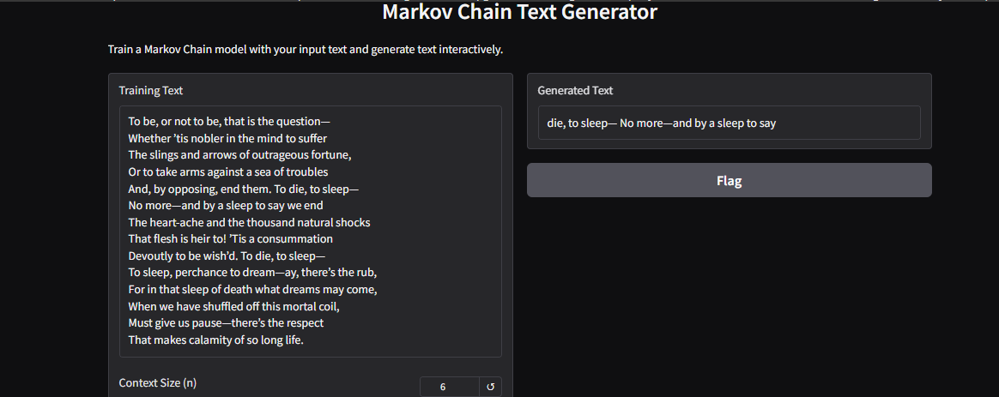

# Futureinter_AI_03
Text generation algorithm using Markov chains

# MarkovChain_AI_01

# Text Generation with Markov Chains

This project implements a **Markov Chain Text Generator** using Python. It enables users to train a Markov Chain model with their own text input and generate text dynamically. The project is built entirely within a **Jupyter Notebook**, and an interactive interface is provided through **Gradio**.

## Features
- Train a Markov Chain model with custom input text.
- Adjustable context size (`n`) for more coherent text generation.
- Generate text of any desired length dynamically.
- Interactive interface for seamless experimentation using **Gradio**.

## Try It Out on Google Colab

## Demo
Here’s an example of the interface:

## Prerequisites
Before running the project locally or on Colab, ensure the following:
- **Python 3.7** or later.
- Required Python libraries are installed (`gradio`, `collections`, `random`).
- A web browser to access the Gradio interface.

## Usage
1. Open the Colab notebook using the link above.
2. Follow these steps within the notebook:
   - Input training text in the provided text box.
   - Adjust the **context size (n)** slider to control the model's memory.
   - Specify the desired **output length** of the generated text.
   - Click "Submit" to train the model and generate text interactively.
3. View the generated text in the output box.

## Example
### Input Training Text:
